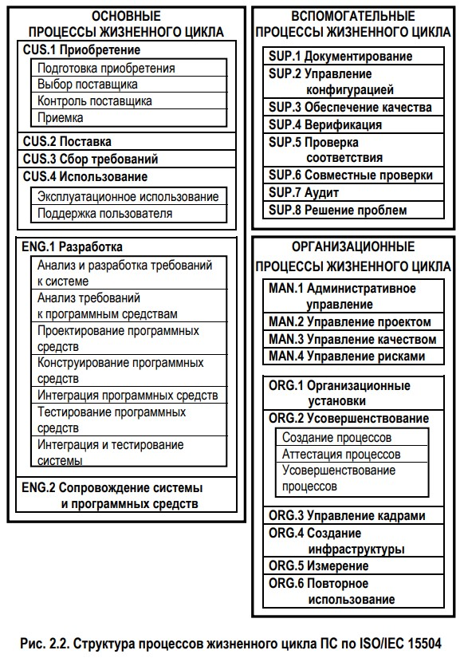

[3 3 28. Опишите архитектуру процессов жизненного цикла ПС установленную в ISO/IEC TR 15504-2.](#7)

[3 3 29. Дайте краткую характеристику основных категорий процессов жизненного цикла ПС, которые выделяются в ISO/IEC TR 15504-2 (потребитель-поставщик, инженерная, вспомогательная, управленческая, организационная).](#8)

## 
3 3 28. Опишите архитектуру процессов жизненного цикла ПС установленную в ISO/IEC TR 15504-2.

Стандарт ISO/IEC TR 15504 вышел в 1998 г. Он устанавливает основу для аттестации зрелости процессов жизненного цикла ПС. Эта основа может быть использована организациями, занимающимися планированием, управлением, наблюдением, контролем и совершенствованием приобретения, поставки, разработки, эксплуатации и поддержки ПС.

15504 состоит из девяти частей. Вторая часть стандарта – ИСО/МЭК 15504-2 описывает набор универсальных процессов, которые являются фундаментальными для программной инженерии. Эта часть определяет эталонную модель процессов и их зрелости, которая формирует базис для любой модели, применяемой для аттестации процессов. Эталонная модель использует двумерный подход к оцениванию зрелости процессов – одно измерение определяет процессы, подлежащие аттестации, другое описывает шкалу для измерения зрелости процессов. В измерении «процесс» эталонная модель описывает назначение процессов.

Выделяют три типа процессов первого уровня (базовый, расширенный и новый) и два – второго уровня (составляющий и расширенный составляющий)

По аналогии с ISO/IEC 12207 эталонная модель **группирует процессы** жизненного цикла ПС в три группы (рис. 2.2): 

1. группа основных процессов состоит из категорий процессов потребитель-поставщик и инженерной категории процессов; 
2. группа вспомогательных процессов состоит из вспомогательной категории процессов; 
3. группа организационных процессов состоит из управленческой и организационной категорий процессов.

Процессы категории потребитель-поставщик состоят из 4 процессов первого уровня и 6 процессов второго уровня (табл. 2.6).

## 
3 3 29. Дайте краткую характеристику основных категорий процессов жизненного цикла ПС, которые выделяются в ISO/IEC TR 15504-2 (потребитель-поставщик, инженерная, вспомогательная, управленческая, организационная).

1. Потребитель-поставщик - процессы затрагивающие потребителя, поддерживающие разработку и передачу ПС потребителю.
2. Инженерная - процессы, которые определяют, реализуют или сопровождают программный продукт, его взаимодействие с системой и документацию.
3. Вспомогательная - процессы, которые могут использоваться любыми другими процессами на протяжении всего ЖЦПС.
4. Управленческая - процессы, содержащие общие действия, могут быть использованы теми, кто управляет проектом или процессом.
5. Организационная - процессы, устанавливающие бизнес-цели организации и создающие такие активы процессов, которые способствуют достижению её бизнес-целей.