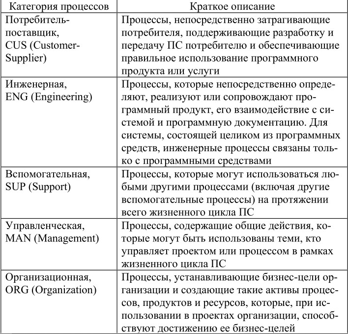

[3 3 28. Опишите архитектуру процессов жизненного цикла ПС установленную в ISO/IEC TR 15504-2.](#7)

[3 3 29. Дайте краткую характеристику основных категорий процессов жизненного цикла ПС, которые выделяются в ISO/IEC TR 15504-2 (потребитель-поставщик, инженерная, вспомогательная, управленческая, организационная).](#8)

## 
3 3 28. Опишите архитектуру процессов жизненного цикла ПС установленную в ISO/IEC TR 15504-2.

Стандарт ISO/IEC TR 15504 вышел в 1998 г. Он устанавливает основу для аттестации зрелости процессов жизненного цикла ПС. Эта основа может быть использована организациями, занимающимися планированием, управлением, наблюдением, контролем и совершенствованием приобретения, поставки, разработки, эксплуатации и поддержки ПС.

15504 состоит из девяти частей. Вторая часть стандарта – ИСО/МЭК 15504-2 описывает набор универсальных процессов, которые являются фундаментальными для программной инженерии. Эта часть определяет эталонную модель процессов и их зрелости, которая формирует базис для любой модели, применяемой для аттестации процессов. Эталонная модель использует двумерный подход к оцениванию зрелости процессов – одно измерение определяет процессы, подлежащие аттестации, другое описывает шкалу для измерения зрелости процессов. В измерении «процесс» эталонная модель описывает назначение процессов.

## 
3 3 29. Дайте краткую характеристику основных категорий процессов жизненного цикла ПС, которые выделяются в ISO/IEC TR 15504-2 (потребитель-поставщик, инженерная, вспомогательная, управленческая, организационная).

